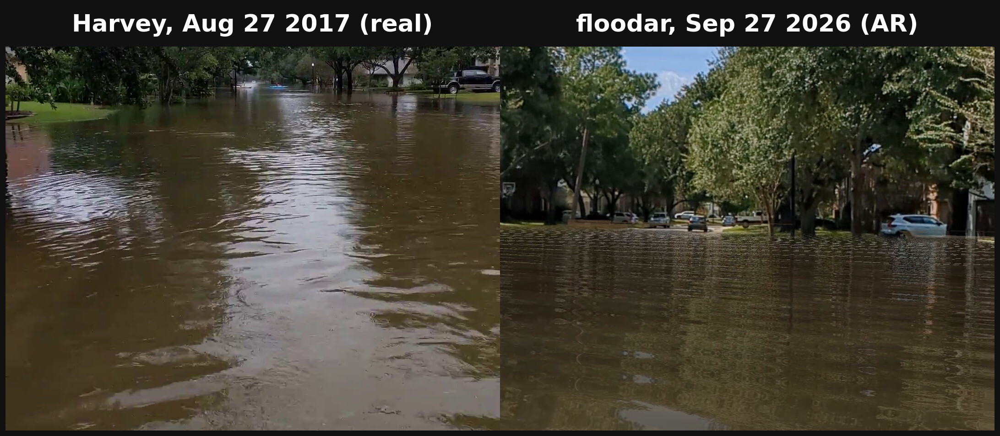

# Flood AR (floodar)

**See Houston's real floods where you stand.** Flood AR is an Android augmented-reality app:
hold up your phone, and the water from a real, documented flood appears in the live camera view
of your street, or your living room, at the depth it actually reached.

*Houston Hackathon 2026.*

- 🎬 **Demo video (3 min):** https://youtu.be/eTixT4tzWrQ
- 📱 **Try it:** [APK download](https://github.com/buck/floodar/releases/tag/v0.1-hackathon): works on most Android phones from the last few years (the ones Google supports for AR; [check the list](https://developers.google.com/ar/devices)).
- 📄 **How it works (full write-up):** [docs/how-it-works.md](docs/how-it-works.md)



## What it does

- **Real water levels.** Surveyed high-water marks from the Harris County Flood Control District
  (Memorial Day 2015, Tax Day 2016, Harvey 2017, Imelda 2019), plus HCFCD's 100- and 500-year
  levels, combined with USGS elevation data. Every scenario records which surveyed marks it came
  from.
- **Anywhere.** Stand at the site, or "teleport" a documented depth to your own street, or use
  **Custom depth** for any number of feet and inches.
- **Water you believe.** Muddy water that reflects the live camera image, with flow ripples; a
  debris line on real buildings (Google's 3D building data); and a 1-ft striped depth gauge.
- **History.** Reconstructs the 2010 FEMA/Texas storm-surge marker that Houston removed from
  Clear Lake in 2011, next to the depth the data actually supports.
- **Checked against reality.** A resident's Harvey video and debris-line photo from 2017 were
  compared with the app in the same street in 2026 (see [write-up §2.5](docs/how-it-works.md)).

## Install (APK)

1. Download the APK from the release on this repository's Releases page. It runs on most Android
   phones from the last few years ([Google's supported-device list](https://developers.google.com/ar/devices)).
2. On the phone, open it and allow "install unknown apps" when asked.
3. Open Flood AR, tap **MENU → Flood site…**, pick a site and flood, and tap the ground.

## Build

```bash
# JDK 17 (Gradle 8.6 / AGP 8.4)
./gradlew :app:assembleDebug
adb install -r app/build/outputs/apk/debug/app-debug.apk
```

Put an ARCore API key in `local.properties` as `arcore.api.key=…`. The key used for released
APKs is restricted to this app's package and signing certificate, so a locally built app needs
its own key for Geospatial features. Plane detection, the water and the gauge work without it.

The data pipeline (PostGIS, USGS DEM, HCFCD high-water marks) is in [`db/`](db/); see
[write-up §2](docs/how-it-works.md#2-data-pipeline).

## Docs

- [How it works](docs/how-it-works.md): design, data, validation, limitations
- [Devpost submission text](docs/devpost.md)
- [Prior art in AR flood visualization](docs/appendix-ar-flood-history.md) ([verified references](docs/ar-flood-history-references.md))
- [The Clear Lake storm-surge markers](fema_storm_surge_markers_report.md) ([verified references](docs/fema-marker-references.md))
- [Field test checklist](docs/field-test-checklist.md)

## License

Apache License 2.0 (see [LICENSE](LICENSE)). The app began as a fork of Google's ARCore
`geospatial_java` sample, also Apache 2.0.
