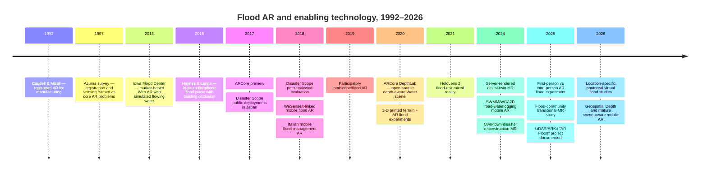
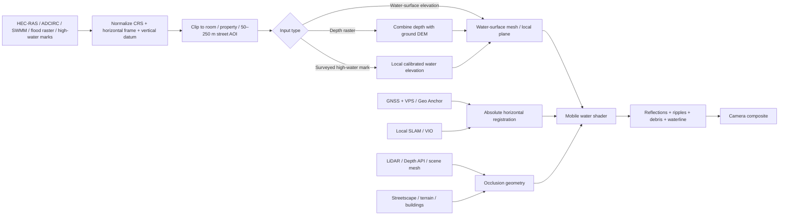

> **Appendix: background research.** This report was produced with AI-assisted deep research
> (OpenAI ChatGPT deep research, September 2026) from the prompt in `ar_flood_history_prompt.md`.
> Inline citation markers from the export have been removed. **Verified bibliographic references,
> with links and the claims spot-checked against sources, are in
> [`ar-flood-history-references.md`](ar-flood-history-references.md).** For sentence-level
> sourcing, see the PDF version (`GPT-ar-flood-report.pdf`).
>
> Corrections from verification: the "2,123 high-water marks / 19 inundation maps" figures are
> from USGS SIR 2018-5070. The Beckman "AR Flood" USGS provenance is unconfirmed.

# Augmented-Reality Flood Visualization at Room-to-Street Scale: History, Prior Art, and the 2026 State of the Art

## Executive summary

The most important finding is that **the core experiential idea behind your Houston Hackathon project has clear prior art, but the particular combination you are building is still unusual**. The closest precedent I found is Tomoki Itamiya's **Disaster Scope**, developed in Japan by at least 2017–2018. It deliberately superimposes floodwater, debris, and other disaster effects onto the **actual place where the participant is standing**, including ordinary rooms, schools, workplaces, and homes. Its 2018 peer-reviewed description says a phone equipped with a 3-D depth sensor recognized surrounding objects and the device's height above the ground, making low-level flooding inside a room more realistic; it was then used in school and municipal evacuation drills, with survey results indicating increased disaster-risk awareness. The present-day organization behind it explicitly describes the psychological proposition as transforming a familiar place into the site of a disaster.

That means the striking experience you discovered—*“my house is full of water”*—is not merely an accidental graphics effect. Other researchers independently converged on essentially the same risk-communication idea. Disaster Scope is especially close: it used depth sensing and occlusion, represented water and floating debris, operated in familiar real environments, and was explicitly designed to turn an abstract hazard into something people perceive as happening **here**. Weathernews subsequently commercialized a related AR inundation simulator in Japan in which users could look at their home or workplace and adjust inundation in 10 cm increments.

At the same time, I did **not** find a published controlled experiment that isolates your exact effect: participants viewing realistically reflective/rippling floodwater filling **their own physical room through handheld AR**, compared with maps, photographs, high-water marks, or a non-personalized control. There is strong adjacent evidence. First-person AR flood experiences increase perceived vulnerability and proactive intentions; controlled VR flood experiments have produced more protective investment than control conditions; location-specific virtual-flood systems improve people's ability to envision local evacuation situations; and recent mixed-reality studies report increased understanding and engagement relative to conventional tools. But the psychological effect of “the flood is inside *my actual room*” remains surprisingly under-measured.

Technically, an equally important precedent is Google's open-source **ARCore Depth Lab**. Its 2020 code contains an actual `Water` scene that uses depth-aware GPU occlusion to create a **flooding effect in the physical environment**. It also demonstrates depth meshes, particle collisions, relighting, physics, fog, and occlusion. It was not created as a disaster-risk product, but from an implementation standpoint it is one of the most directly reusable pieces of prior art for the room-flood illusion you describe. The project is now unmaintained and built against old Unity/AR Foundation versions, but the techniques and Apache-2.0 code remain valuable.

For outdoor street-scale work, a second historical line begins with Haynes and Lange's **2016 smartphone AR flood visualization**. It put an adjustable flood plane into a real riverside view and used simple 3-D cuboids representing buildings as occluders so that the water appeared to pass behind structures rather than simply being painted over the camera image. Their 2018 follow-up integrated in-situ authoring and live flood-sensor data. These projects are conceptually much closer to your 50–250 m street objective than city-scale digital twins are.

The 2026 state of the art is now substantially ahead of those systems. On supported Android phones, **ARCore Geospatial + VPS + Streetscape Geometry + Geospatial Depth** can combine local visual-inertial tracking with geographic coordinates, terrain/building geometry, and depth extending to as much as 65 m from the current device position in supported areas. On LiDAR-equipped Apple devices, **ARKit Scene Reconstruction** supplies a polygonal mesh of the physical environment that can occlude virtual content and participate in physics; Apple's geographic tracking is a separate outdoor-only system using GPS, map data, compass data, and visual localization.

For **your scale**, however, the biggest engineering problem is not 250 m of horizontal extent. It is **vertical registration**. GPS.gov gives roughly 4.9 m horizontal smartphone accuracy under open sky as a typical figure, while Google's developer guidance warns that mobile altitude observations can sometimes be off by as much as roughly 25 m. Meanwhile ARCore's VPS improves geographic localization but its documented typical positional accuracy is still on the order of meters rather than survey centimeters. A one-meter vertical error can completely change whether the flood seems ankle-deep, waist-deep, or above the windows.

For a Houston hackathon demonstration, my strongest technical conclusion is therefore **not to make raw phone altitude authoritative**. Establish the flood vertically from a known local reference—surveyed high-water mark, building finished-floor elevation, curb/benchmark, known hydraulic water-surface elevation, or a user-calibrated reference point—and then let AR tracking maintain the visual relationship locally. USGS's Harvey data are unusually well suited to this: the agency documented **2,123 Texas high-water marks** and produced water-surface rasters, flood-depth layers, and 19 flood-inundation maps, including San Jacinto River data.

The Houston-specific opportunity is consequently strong: instead of merely saying *“this street had four feet of water during Harvey,”* the app can connect an authoritative historical water-surface/depth product to a physically convincing AR waterline. That combination—**real historical flood elevation + one's familiar surroundings + modern scene-aware AR + credible water rendering**—appears less common than either flood visualization or visually impressive AR water considered separately. That is where your project has a defensible point of distinction.

This report follows the room/house/yard/roughly 50–250 m street-scale scope in your supplied research brief rather than treating metropolitan-scale flood visualization as the primary problem.

## Taxonomy, historical development, and major precedents

### What counts as flood AR

The literature becomes much easier to understand if “flood AR” is separated into several technical classes. Early and simple applications place a **label, ruler, or flood-height marker** in the view. The next step is a **virtual water plane**, normally horizontal and positioned relative to the local AR coordinate system. More advanced systems are **environment-aware**: real walls, furniture, terrain, or buildings can occlude the water, or a depth/scene mesh affects its appearance. A separate axis is **geographic registration**: the flood elevation corresponds to a real-world coordinate or modeled water-surface elevation rather than an arbitrary height selected by the user. Finally, some systems are designed primarily for **immersive risk communication** rather than technical analysis. These categories overlap; Disaster Scope, for example, is simultaneously environment-aware and experiential, while Haynes and Lange's work combined in-situ visualization with primitive occlusion.

The history does not begin with flood applications. Caudell and Mizell's 1992 Boeing work described a see-through head-mounted system in which computer graphics were registered to physical objects, and Azuma's landmark 1997 survey identified real/virtual integration, real-time interaction, and spatial registration as defining problems of AR. Registration error was already identified as a central difficulty. I found no convincing evidence of a dedicated flood-AR application from the 1990s; for this topic, the decade is best treated as the enabling technological foundation rather than the beginning of flood visualization itself.

A striking early flood-specific system appeared in **2013** at the Iowa Flood Center: Skeel Lee's open-source `ifc-ar-flood`. It was marker-based Web AR rather than modern SLAM. A webcam recognized encoded markers, a height map generated terrain, and a GPU simulation allowed water to accumulate behind terrain and objects, flow from high to low areas, float dynamic objects, and generate ripples when those objects displaced water. In other words, before today's phone AR stacks existed, it already explored something modern AR flood demos often omit: water/geometry interaction rather than merely drawing a blue plane.

The important transition to **the user's real outdoor landscape** is visible in Haynes and Lange's 2016 work. Their smartphone application visualized adjustable flood levels in an urban riverside landscape and created simple cuboid building representations expressly to occlude the flood plane correctly. That is an early direct ancestor of a street-level system. Their expanded 2018 system added real-time in-situ authoring, sensor readings from the WeSenseIt network, and evaluation by water-management experts, who gave positive feedback about the approach's potential.

At almost exactly the same time, Japan produced the most important precedent for **your experiential concept**. Disaster Scope superimposed CG floods, debris, fire, and smoke on real scenery using smartphones and, in early versions, depth-sensing hardware derived from Google's Tango generation. Its authors explicitly reported using 3-D depth sensing to determine height from the floor and recognize nearby objects, producing a more convincing low-water-level flood inside a room. The system was used in evacuation drills rather than confined to a laboratory prototype.

Google's 2017 ARCore announcement marks another inflection point because it brought Tango-derived motion tracking and environmental understanding to ordinary phones without requiring dedicated Tango hardware. That transition is significant historically: techniques that had required specialist depth hardware increasingly became deployable at consumer scale.

The flood-AR literature then broadened. A 2018 Italian system used mobile AR and a client-server architecture to support field teams during flood events on the Bradano River. Tomkins and Lange's 2019 work moved toward participatory flood-risk communication and interactive 3-D cartography. Another 2019/2020 line combined AR with a **3-D-printed terrain model**, reaching a stable 60 FPS and reporting that users found the hybrid physical/virtual flood representation more intuitive than its all-virtual comparison.

In 2020, Google's **DepthLab** was a major enabling milestone for room-scale realism. Rather than a flood-risk application, it was an AR interaction research platform published at ACM UIST; nevertheless, its open-source Unity project contains a dedicated water/flooding sample based on depth-aware occlusion, as well as physical-environment collision, depth meshes, particle collision, re-lighting, and other techniques directly relevant to a believable room flood.

By 2021, flood visualization had also entered optical see-through mixed reality. Rydvanskiy and Hedley studied flood visualization using HoloLens 2 and Fraser River/Vancouver-area geospatial information, focusing not merely on visualization technology but on usability and how flood-risk-management information could be understood in mixed reality.

Recent work increasingly connects AR/MR to substantial flood models and digital twins. Tsujimoto, Fukuda, and Yabuki's 2024 **Server-enabled mixed reality for flood risk communication** streamed large flood/digital-city content to mobile web clients, reporting about 16 FPS while shifting heavy rendering work to a server; the associated “Server Stream on Sight MR” software was archived on Zenodo. A separate 2024 urban-waterlogging system for Wuhan integrated SWMM with a two-dimensional inundation model and rendered pipe networks and road inundation in mobile AR at more than 30 FPS.

A particularly relevant 2024 Japanese system went beyond generic hazards and reconstructed disaster situations in **residents' own town**, using hazard-map information and victims' memories. Its stated goal was explicitly to help residents make disasters personal; questionnaire and opinion evaluation found that the reconstruction helped participants imagine the disaster situation and perceive it as personally relevant.

In 2025, research began to examine perspective more directly. A within-subject AR flash-flood study found that a **first-person perspective** increased perceived vulnerability and proactive intentions, whereas third-person presentation improved situational awareness and perceived response efficacy. A 2025 IEEE TVCG co-design study with flood-prone communities reported greater understanding and engagement from transitional mixed-reality flood communication than traditional tools, though usability challenges remained for some older participants.

Also in 2025, Daniel Beckman's portfolio documented a project called **AR Flood**, described as an ARKit/LiDAR system taking a geographic coordinate and predicted flood height and using scene understanding plus a Shader Graph water effect that visually pools against walls, flows around terrain, and aligns with real surfaces. The page says it was “originally developed by the USGS HAIL team.” This would be extraordinarily close technical prior art to your project. However, I could not independently confirm a current USGS publication or accessible public source repository from the materials indexed in this search, so I would treat the USGS provenance and reuse availability as a **promising lead requiring verification**, not as firmly established open-source prior art.

Finally, 2026 work is moving toward personalized, photorealistic locality even where AR itself is not used. Banno and colleagues' **Realistic Virtual Flood Experience System** combines real 360° imagery with 3-D buildings automatically generated from ordinary building footprints; a study with local residents in Memuro, Hokkaido found that the location-specific representation improved their ability to envision evacuation situations. That result matters because it isolates something very close to your intuition: familiar, identifiable surroundings contribute to making flood risk cognitively concrete.

### Chronological view

The sequence above is supported by the foundational AR papers, the Iowa code repository, Haynes/Lange's 2016 and 2018 work, Disaster Scope, DepthLab, recent flood-MR papers, and current platform documentation.

## Room-scale flooding, realism, and the visceral effect

### Disaster Scope is the closest experiential precedent

Among the systems I found, **Disaster Scope is the closest conceptual precedent** to “point my phone around my own house and suddenly understand what six feet of floodwater would mean.” The academic paper describes CG flood and smoke over actual scenery; a depth-sensing smartphone determines the floor relationship and nearby geometry; and the system was explicitly tested in evacuation drills. The contemporary AR Bosai site describes use at a normal workplace, school, home, or room and says the point is to make fire, smoke, and flooding occur in “the place where you are” rather than in a separate virtual world.

Early demonstrations used Google's Tango-style spatial understanding to resolve occlusion. Contemporary reporting on the system described water and debris appearing to pass correctly around people and objects, and children reacting vocally as familiar classmates and teachers appeared immersed in floodwater. Those anecdotal reactions are not equivalent to a controlled psychological experiment, but they are unusually direct evidence that the “real people and familiar room under virtual water” effect can be emotionally powerful.

Weathernews turned that idea into a consumer-facing **AR inundation simulator**, based on Disaster Scope technology. Its 2020 announcement explicitly framed the use case as looking at familiar scenery such as one's home or workplace and seeing simulated inundation; users could change the flood depth in 10 cm increments. That is remarkably close to the basic interaction model of your application, although it appears to have been primarily a risk-awareness visualization rather than a historically precise hydraulic reconstruction.

### The most reusable technical precedent may be Google's DepthLab

DepthLab's importance is easy to miss because “flood” is not its research topic. Its source tree nevertheless contains a **Water** scene whose documentation says it uses a modified GPU occlusion shader to create an artificial-water flooding effect in the physical environment. The same project demonstrates dense depth, screen-space depth meshes, particle collision with physical surfaces, AR fog, re-lighting, physical-object collision, and surface normal estimation. It is Apache-2.0 licensed.

That makes DepthLab an unusually clean technical baseline for answering the question “what causes the effect to feel like the room itself contains water?” Modern scene geometry allows the real world and virtual water to participate in a believable **depth ordering**. Without occlusion, the virtual water is merely a transparent graphic painted over chairs, walls, people, and doorways. With a depth or reconstructed mesh, the renderer can decide which physical surfaces lie in front of the virtual water and which lie behind it. Apple's Scene Reconstruction likewise provides a polygonal estimate of the physical environment specifically usable for occlusion, physics, shadows, and virtual interaction.

For an indoor flood, the single most important visual feature is arguably the **stable waterline against familiar vertical geometry**. This is an engineering inference rather than the result of a published flood-specific cue-ablation experiment. A waterline crossing your sofa, cabinets, doors, or staircase immediately provides scale and depth. Disaster Scope's use of object recognition/occlusion, DepthLab's explicit depth-aware water sample, and your own observation all point in the same direction.

Reflections and moving surface normals provide another powerful cue. ARKit supports environment texturing in which camera imagery contributes to environment maps for image-based lighting and reflections; that makes it possible for a virtual reflective surface to borrow the lighting character of the actual room rather than looking like an unrelated computer graphic.

For a phone, full computational fluid dynamics is generally unnecessary to produce the illusion you care about. The Iowa prototype performed genuine heightfield-style water behavior, but Google's DepthLab creates its flood appearance primarily with GPU rendering and depth/occlusion; Disaster Scope's objective was perceived disaster realism rather than hydrodynamically exact fluid mechanics. The visually effective compromise is therefore a **hydraulically correct water elevation but graphically synthesized small-scale surface motion**. The water surface can be located from real flood data while ripples, wave normals, Fresnel response, reflection, refraction, foam, sediment coloration, and debris are artistic/real-time effects.

That distinction is valuable: **hydrology determines where the water is; the shader determines whether you believe it.**

### Practical room-flood rendering stack

For a high-impact mobile implementation, I would distinguish the following rendering layers conceptually rather than trying to build a fluid simulator.

The physical-world geometry layer comes first: detect the floor, reconstruct or sample depth for walls/furniture, and maintain an occlusion representation. On LiDAR iPhones/iPads, ARKit's scene reconstruction is the strongest consumer-phone option because it produces an explicit polygon mesh. On Android, ARCore Depth provides dense screen-space depth derived from motion and, on some devices, hardware depth; Google's own examples turn that information into screen-space geometry and occlusion masks.

The virtual-water layer can then be geometrically simple. A horizontal plane is adequate indoors unless you are deliberately simulating flow down stairs or through openings. Animated normal maps can provide small waves and overlapping ripple scales. A Fresnel-like view-dependent reflection term, environmental reflection, moderate transparency/refraction, and subtle depth-dependent coloration can make the plane read as a volume rather than a blue sheet. Environment maps are particularly attractive on mobile because the platform can derive them from the real camera scene.

Debris is more than decoration. Disaster Scope deliberately added floating debris, and the early Iowa system used dynamic floating objects and ripples. Debris provides the visual system with motion, scale, flow direction, and a reference for the danger of moving floodwater.

A camera crossing the virtual water elevation should also change the rendering regime. Even a simple transition—reduced contrast, altered color/attenuation, particulate matter, and muffled/altered audio—can turn “there is a water plane at eye level” into “I have put my head under floodwater.” DepthLab demonstrates related depth-aware fog and relighting techniques that can be adapted to such an effect.

Audio is likely complementary rather than the principal driver. A 2026 controlled VR flood study manipulating multimodal warnings found the visual water condition to be an especially strong cue for evacuation decisions; combinations of cues could produce immediate-evacuation rates as high as 93% in its small, 14-participant experiment. That study is not an AR-room experiment, but it supports treating visible floodwater itself as a primary signal and sirens/alerts/audio as reinforcing channels.

### What the psychology research actually establishes

The strongest controlled behavioral evidence I found comes from immersive **VR**, not AR. Mol, Botzen, and Blasch reported that people who experienced a virtual flood subsequently invested significantly more in flood-risk reduction in an experimental decision task than controls; the apparent effect weakened at a four-week follow-up, although the decline was not statistically conclusive.

More recent AR research begins to isolate viewpoint. In the 2025 first-person/third-person flash-flood study, first-person presentation increased perceived vulnerability and proactive behavioral intentions, while third-person presentation better supported situational awareness and response efficacy. That is directly relevant to handheld AR because your application naturally places the camera at the user's own eye position—effectively an embodied first-person viewpoint.

Other controlled VR research has moved beyond questionnaires toward behavior. A 2025 study exposed 50 participants to 32 flood scenarios varying lighting, rainfall, alarm conditions, and whether the participant was walking or driving; another 2026 flood-crowd study found social information and crowd behavior could strongly influence evacuation decisions. These are not evidence that photorealistic water alone changes behavior, but they show that immersive simulations can become useful experimental environments for studying decisions that ordinary maps cannot reproduce.

A 2024 virtual flood experience system similarly evaluated both realism and evacuation behavior, while the 2026 location-specific 360° system found that locally recognizable scenes helped residents envision location-specific evacuation circumstances.

The literature therefore supports a cautious formulation of what you observed:

> **Immersive first-person flood visualization can increase perceived vulnerability, engagement, and preparedness-related responses; familiar/local environments appear to improve people's ability to imagine the consequences. But the incremental psychological impact of flooding one's own physical room in AR has not yet been well isolated experimentally.**

That gap may be more interesting academically than claiming the visualization itself is unprecedented.

## Street-scale AR: localization, elevation, occlusion, and failure modes

Your outdoor target—roughly **50–250 m**—is a useful sweet spot. It is much larger than an indoor AR session, but small enough that you do not actually need the complexity of a global digital twin merely to render water. The challenge is maintaining a convincing relationship among four coordinate systems: the hydraulic model, the geographic world, the local AR tracking frame, and the real camera/depth scene.

### Horizontal localization is now workable; vertical localization remains the danger

Ordinary civilian smartphone GPS is not precise enough to align a flood edge to a curb or doorway. GPS.gov describes smartphone accuracy under open sky as typically around **4.9 m radius horizontally**, with degradation around buildings and trees. ARCore Geospatial supplements GNSS with the phone camera and Google's VPS, matching visible features to a Street View-derived 3-D localization model. Google's documentation describes typical VPS localization on the order of roughly **5 m position and 5° orientation** under appropriate conditions—not surveying accuracy, but generally good enough to establish which building or street segment an AR experience belongs to.

Once localized, visual-inertial tracking handles smooth local motion far better than repeatedly positioning every frame from raw GPS. That is the essential hybrid: **GPS/VPS establishes the absolute frame; SLAM/VIO maintains local continuity**. ARCore explicitly merges the local AR coordinate system with geographic coordinates.

Apple's equivalent geographic mode uses GPS, map data, compass data, and visual localization, but there are consequential restrictions: `ARGeoTrackingConfiguration` works only outdoors, requires internet connectivity, and is available only in supported geographic locations. Apple's guidance also tells developers to aim the camera at distinctive buildings and landmarks rather than generic trees, temporary objects, or nighttime scenes while localization is occurring.

The **vertical** problem is worse. Google's developer guidance has warned that ordinary mobile altitude observations can be wrong by as much as roughly **25 m**. Even an error of one or two meters would be unacceptable for a flood visualization meant to show whether water reached a person's knees, countertops, or ceiling.

This leads to a strong design recommendation: **never define the authoritative flood waterline as `phone altitude + flood depth`.** The phone should locate the user, not define the flood datum.

### Datum errors can dwarf AR tracking errors

Hydraulic and survey data use vertical datums; GNSS fundamentally measures height relative to an ellipsoid. Those are not interchangeable. The National Geodetic Survey distinguishes ellipsoidal height from orthometric height and supplies geoid models to transform between them. For the United States, GEOID18 supports the relationship between NAD83(2011) ellipsoid heights and NAVD88 orthometric elevations; applying it correctly requires paying attention to the horizontal reference frame as well as the vertical datum.

The conventional relation is:

\[
H \approx h - N
\]

where \(H\) is orthometric elevation, \(h\) is ellipsoidal height, and \(N\) is geoid height. Across the continental United States the difference is tens of meters, not centimeters, so accidentally treating an ellipsoid height as “feet above sea level” can put the AR flood plane catastrophically far from reality.

For your use case, there is a better solution. Suppose a historical water-surface elevation is \(H_w\), and you have a known real-world reference point with elevation \(H_r\). Place the AR origin physically at that reference and calculate:

\[
y_{\text{water}} = H_w - H_r
\]

The large absolute elevation disappears; the app only needs to render the **difference**. If \(H_r\) is a surveyed high-water benchmark, finished-floor elevation, bridge/curb survey point, or a manually aligned physical reference, vertical GNSS accuracy largely stops being your limiting variable. This is an engineering inference built on NGS datum practice and the known weakness of phone altitude measurements.

For a hackathon prototype, a calibration interaction can therefore be a feature, not an embarrassment: “Point at this curb / doorway / known mark; tap when the marker is aligned.” Once local visual tracking owns the frame, the water elevation relative to that physical point can be much more convincing than an allegedly automatic but vertically wrong GPS solution.

### Outdoor occlusion has improved dramatically

ARCore Depth estimates per-pixel scene depth without requiring a dedicated depth sensor on every device. Google's documentation characterizes the highest-quality working region as roughly the first several meters and explains that depth quality depends on visual features and device motion.

For outdoor scenes, **Geospatial Depth** is more consequential. When Geospatial, Streetscape Geometry, and Depth are enabled in an area with VPS support, Google can merge local depth with terrain/building information, extending the useful depth field from the ordinary roughly 20–30 m scale out to **65 m**. This is close to ideal for “water goes behind the house across the street” or “the next block partially disappears behind real buildings.”

The open-source **Mega Golf** demo is useful proof that this infrastructure can support street-scale physical interaction rather than merely labels. It uses ARCore Geospatial plus Streetscape Geometry to place a golf hole as far as about 80 m away and uses building/terrain geometry to constrain balls and obstacles. That is essentially the same geometric capability a flood app needs for “water behind this building, around that street corner, and registered to terrain.”

Apple's LiDAR scene reconstruction provides excellent local geometry but Apple geo tracking and local scene meshing should be thought of as distinct systems. The scene mesh is especially powerful indoors or in the immediate outdoor surroundings; the geographic anchor provides global identity.

At 250 m you do not need a single 250 m depth map. You need the system to maintain geographic registration while the user walks and continuously build/use **local geometry around the current camera**. This is precisely where a hybrid of geographic anchors and local scene understanding makes more sense than attempting to scan the entire street at launch.

### Failure modes that matter most

| Failure | Relevant magnitude/evidence | Consequence for flood AR | Mitigation |
|---|---|---|---|
| Ordinary GNSS horizontal error | Smartphone GPS typically ~4.9 m radius under open sky; worse near obstruction. | Water edge may cross the wrong yard/house. | Use VPS/geospatial localization, then local VIO. |
| Raw phone altitude | Mobile altitude can be wrong by up to roughly 25 m in Google's guidance. | Catastrophic flood-height error. | Use surveyed/model elevation plus local reference calibration. |
| VPS/geo localization error | Typical Geospatial/VPS accuracy remains meter-scale rather than survey-scale. | Objects can be visibly offset from façades/curbs. | Geospatial for coarse absolute placement; local calibration for visible waterline. |
| Wrong vertical datum | Ellipsoid and NAVD88-type orthometric elevations differ by tens of meters. | Entire water surface vertically misplaced. | Normalize reference frame and vertical datum before AR. |
| Feature-poor scene | Visual depth/localization is weaker on low-texture surfaces; Apple explicitly warns against generic/transient features for geo localization. | Lawns, blank roads, darkness, vegetation can hurt tracking. | Initialize facing buildings/signs; maintain visual-inertial tracking. |
| Local depth range | Conventional depth is local; Geospatial Depth extends to 65 m. | Far buildings otherwise fail to occlude water. | Use Streetscape/terrain meshes outside local-depth region. |
| Apple geo limitations | Outdoor only, internet required, coverage-dependent. | Cannot use geo tracking for the indoor part of the experience. | Switch to ordinary world tracking/scene reconstruction indoors. |
| AR session relocalization | Both Apple and Google rely on recognizable visual/environmental information. | Water may jump or temporarily lose absolute alignment. | Persist scenario data geographically; reconstruct local anchors after localization. |
| Real-world dynamic objects | Cars, people, vegetation are not reliably represented in static building meshes. Google's semantic/depth APIs treat these separately. | Water can appear incorrectly in front of/behind moving objects. | Prefer live depth for near field, Streetscape for static far field. |

A notable research gap is that many flood-AR papers report usability or frame rate while giving relatively little longitudinal measurement of **AR drift in centimeters/meters over a 50–250 m walking trajectory**. For your actual product, that engineering measurement would be worth collecting yourself: start at a known marker, walk 50, 100, and 200 m, return, and measure the rendered waterline against multiple known reference elevations. The lack of published flood-specific drift benchmarks is apparent across the otherwise relevant Haynes/Lange, Disaster Scope, and recent mobile-MR literature.

## Flood-data pipelines and Houston/Gulf Coast opportunities

The data side is fortunately easier than the AR side. Modern hydraulic packages already output quantities almost exactly suited to visualization. HEC-RAS RAS Mapper writes results including **water-surface elevation, depth, and velocity**, tied to terrain. Its normal inundation workflow derives depth from modeled water-surface elevation relative to an associated terrain model.

ADCIRC likewise produces spatial water levels and can produce maximum inundation depth above ground. For coastal/storm-surge work, that makes ADCIRC output conceptually straightforward to turn into an AR water surface once horizontal coordinates and vertical datums have been normalized.

A practical rendering pipeline does not need the hydraulic solver on the phone:

This architecture follows the same broad separation seen in existing mobile flood AR and digital-twin work: flood computation/data are prepared outside the rendering loop, while the phone handles localization, local interaction, and visualization. The 2024 Wuhan system is a concrete published example of feeding SWMM/two-dimensional inundation results into mobile AR, while the 2024 server-enabled MR work demonstrates another architecture in which complex 3-D flood/city data are rendered remotely and streamed to mobile clients.

For **room-scale historical flooding**, the pipeline can be drastically simpler. If historical evidence says the water reached 1.2 m above the building's finished floor, detect or manually establish the floor and render a plane at local \(y=1.2\) m. No DEM, Cesium globe, or CFD is necessary. If the water surface is historically known as an absolute elevation, derive its local offset from the floor/reference elevation first.

For a gently varying street-scale flood, the distinction between **water-surface elevation** and **flood depth** matters. The water surface may be approximately level over a short region while depth varies dramatically because the street, sidewalks, driveways, and lots rise and fall. If all you have is a depth raster, using “depth as the height of a flat plane” is wrong; the raster must be reconciled with terrain or converted back into water-surface elevation. HEC-RAS's own mapping architecture reflects this relationship between terrain, water-surface elevation, and derived depth.

### Houston is unusually data-rich

Hurricane Harvey provides an excellent demonstration dataset. USGS hydrographers documented **2,123 high-water marks in Texas** after the storm. Those measurements were used with streamgage information to generate flood water-surface rasters, inundation polygons, and depth layers; USGS/FEMA produced **19 inundation maps across 11 river/coastal basins**.

The data are public. USGS's Harvey release includes flood-depth rasters, inundation polygons, mapped boundaries, and HWM locations, while separate datasets cover areas such as the East and West Forks of the San Jacinto River.

USGS describes its methodology clearly: flood elevation surfaces based on high-water marks and peak-stage observations are compared with LiDAR-derived terrain to calculate inundation extent and water depth. That is almost tailor-made for an AR demonstration because the resulting quantities have physical meaning at human scale.

The USGS **Flood Event Viewer** and Short-Term Network provide map-based and downloadable access to storm-event measurements, including high-water marks, storm tide, wave, and sensor information.

The Harris County Flood Warning System adds another local source. It provides live and historical bayou/creek inundation mapping based on gages. Its own documentation cautions that the map represents inundation extent, not depth; mapping updates depend on gage changes and do not capture every possible source of flooding. That makes it useful as contextual data, but not a substitute for a historical depth raster when the goal is an exact waterline at a house.

For visual-reference research, **FloodNet** is also Houston-relevant. It contains high-resolution UAV imagery collected after Harvey and labels flooded roads/buildings for computer-vision research. It does not provide the AR elevation directly, but it could be useful for studying the visual character of genuine Houston floodwater—color, debris, road/building relationships—and eventually for semantic scene analysis.

The obvious hackathon demonstration pipeline is therefore:

**USGS Harvey HWM/depth raster → select one known street → verify its vertical datum → establish one local physical elevation reference → reconstruct nearby geometry → place the historically derived water surface → apply room/street water rendering.** The result would make a much stronger historical claim than an arbitrary “six-foot flood” visualization because the waterline can be traceable to government flood evidence.

## Open source, implementation choices, and the 2026 architecture landscape

### Repositories worth studying

The table below separates genuinely reusable source from historical code and from official SDK/sample repositories. “Buildability” is an assessment based on the repository's stated dependencies/current status rather than a guarantee that I compiled each project.

| Repository | Owner / purpose | Language / engine | License | Activity / buildability in 2026 | Most reusable part |
|---|---|---|---|---|---|
| [`skeelogy/ifc-ar-flood`](https://github.com/skeelogy/ifc-ar-flood) | Skeel Lee / Iowa Flood Center; marker-based Web AR flood simulator | JavaScript, Three.js/WebGL | MIT | **Archival, 2013-era.** Old browser/WebRTC/library dependencies make direct modern deployment unlikely without porting. | Heightfield flood logic, object buoyancy/ripples, historic AR architecture. |
| [`googlesamples/arcore-depth-lab`](https://github.com/googlesamples/arcore-depth-lab) | Google; Depth API realism/interaction research | C#, ShaderLab; Unity/AR Foundation | Apache-2.0 | **No longer actively maintained**; targets Unity 2020-era packages, but source is complete. | The `Water` flooding scene, depth occlusion, screen-space depth mesh, particle collision, relighting. |
| [`google-ar/demo-megagolf`](https://github.com/google-ar/demo-megagolf) | Google/oio; street-scale Geospatial + Streetscape demo | C#, ShaderLab, HLSL; Unity | Apache-2.0 | Builds from a Unity 2022.2-era project; likely needs package upgrading for a new Unity 6 app. | Streetscape geometry, terrain/building interaction and ~80 m geospatial placement. |
| [`Unity-Technologies/arfoundation-samples`](https://github.com/Unity-Technologies/arfoundation-samples) | Unity; canonical cross-platform AR examples | C#; Unity | Unity sample licensing/`LICENSE.md` | **Current**: main-line samples support Unity 6 and current AR Foundation 6.x generations. | Plane detection, meshing, occlusion, anchors, cross-platform ARKit/ARCore abstraction. |
| [`google-ar/arcore-unity-extensions`](https://github.com/google-ar/arcore-unity-extensions) | Google; Geospatial API and Geospatial Creator integration with AR Foundation | C#; Unity | Subject to ARCore Additional Terms | **Current through 2026**; v1.54.0 released Apr. 22, 2026. | Geospatial pose, Terrain/Rooftop/WGS84 anchors, Streetscape integration. |
| [`CesiumGS/cesium-unity`](https://github.com/CesiumGS/cesium-unity) | Cesium; real-world 3-D geospatial content in Unity | C#/C++ | Apache-2.0 | **Actively maintained**, updated Sept. 22, 2026 in the indexed repository snapshot. | WGS84/ECEF coordinates, terrain, imagery, 3D Tiles, origin shifting. |
| [`ropensci/terrainr`](https://github.com/ropensci/terrainr) | rOpenSci; USGS terrain/ortho acquisition and Unity-oriented visualization workflow | R | MIT | Current CRAN/GitHub package; development branch explicitly described as active but potentially unstable. | Automated USGS National Map DEM and orthoimagery preparation. |
| [`google-ar/arcore-android-sdk`](https://github.com/google-ar/arcore-android-sdk) | Google; native ARCore SDK/samples | Java/Kotlin/C++ components | Repository terms / samples | Official repo updated Apr. 22, 2026 in Google's organization listing. | Lowest-level Android access where Unity overhead is undesirable. |

For your specific “house filling with water” problem, I would inspect **DepthLab before almost anything else**. Its Water scene was built to create exactly a flooding-like interaction with the actual camera environment, and its source shows how Google handled depth acquisition, re-projection, GPU textures, occlusion, and related effects.

For the street portion, **Mega Golf** is oddly relevant: replace the golf ball/hole with a flood-surface representation and you inherit a working example of geospatial localization, building geometry, terrain interaction, and tens-of-meters scene relationships.

The historical Iowa code is useful not because you should deploy it but because it demonstrates that **flow behavior and water/object interaction can be separated from AR tracking**. Its simulation ideas could be reimplemented on top of today's scene mesh rather than trying to revive its marker/WebRTC framework.

### Architecture comparison

| Architecture | Positioning / vertical strategy | Occlusion | Offline behavior | Complexity | Cost / service considerations | Fit for this project |
|---|---|---|---|---|---|---|
| **Unity + AR Foundation, local tracking** | Excellent relative tracking; no inherent authoritative global elevation. Use detected floor or manual physical reference. | ARCore Depth or ARKit capabilities through provider plug-ins. | Core local AR can work without a geospatial cloud service. | Medium | Unity licensing applies; no separate global-data stack required. | **Excellent indoor prototype and simplest cross-platform base.** |
| **Unity + ARCore Geospatial + Depth/Streetscape** | VPS/GNSS absolute localization plus local VIO; meter-scale global accuracy, so calibrate vertical locally. | Strong outdoor option; Geospatial Depth reaches up to 65 m with supported configuration. | Geospatial services require network/service access. | Medium–high | Google Cloud credentials; published quota is 1,000 session starts/min and 100,000 requests/min per project. | **Strongest single Android architecture for your outdoor 50–250 m case.** |
| **Native ARKit + Scene Reconstruction** | Very strong local tracking; set water height from floor/known reference. | Excellent explicit scene mesh on supported LiDAR hardware. | Local world tracking/meshing is not dependent on a geographic cloud localization session. | Medium–high | iOS/device constraint. | **Potentially strongest room/house experience on LiDAR-equipped Apple hardware.** |
| **ARKit Geo Tracking + local AR** | GPS/map/compass + visual localization; Apple geo tracking is outdoors only and coverage-dependent. | Local LiDAR mesh where supported; geo tracking itself is not a replacement for a scene mesh. | Geo tracking requires internet. | High because indoor/outdoor modes differ | Apple platform ecosystem. | Good iOS outdoor solution, but less seamless for a room→street experience than a purely local indoor mode plus separate geo mode. |
| **Cesium for Unity + AR Foundation/ARCore** | Excellent geodetic/terrain coordinate management; **Cesium is not the camera-localization system**, so pair it with ARCore/ARKit. | Depends on AR provider plus whatever 3-D Tiles/terrain geometry you load. | Can use private/self-hosted data; ion streaming normally implies network. | High | Plugin is Apache-2.0; Cesium ion is optional. As of Sep. 2026 its listed commercial individual tier starts at $149/month, with a restricted free Community tier. | Useful if hydraulic/terrain geospatial data become central; arguably overkill for one room/street demo. |
| **Unreal + Cesium / mobile AR** | Capable geospatial stack via Cesium, but mobile AR integration is less direct for this use than Unity's current AR Foundation ecosystem. | Engine rendering is powerful; AR provider still determines real-world depth. | Depends on services/data. | High | Cesium plugin open source; engine/service terms separately apply. | Best when visual fidelity and existing Unreal expertise outweigh prototype speed. Google's standalone ARCore Unreal repo itself is obsolete and redirects developers to current Unreal integration. |

My practical choice for a hackathon would be **Unity + AR Foundation as the common layer**, with two modes rather than forcing one localization strategy onto everything:

**Indoor/local mode:** scene tracking + depth/mesh + floor/reference calibration + high-quality water shader.

**Outdoor/historical mode:** the same renderer, with ARCore Geospatial/Streetscape on Android—or Apple's geographic system on iOS—used to identify the place, while a known flood reference establishes authoritative vertical position.

That division also reflects the platforms' actual constraints. Apple's geo configuration explicitly does not function indoors, whereas ordinary AR world tracking does.

### Cesium is useful, but probably not where I would start

Cesium solves a problem adjacent to yours: representing enormous WGS84 coordinates and streaming terrain/3-D geographic data into a game engine. Its Unity implementation uses georeferencing/origin shifting because ordinary Unity coordinates lose useful precision as scenes move many kilometers away from their local origin.

At **250 m**, Earth curvature and globe-scale floating-point management are not really your limiting problem if you transform the relevant hydraulic data into a local East-North-Up frame near the street. Cesium becomes attractive when you want the app to accept arbitrary locations, stream terrain/buildings, or consume substantial geospatial datasets without hand-preparing each site.

For one Houston street, a clipped local DEM/raster plus ARCore/ARKit will probably get you to the “holy crap, that's my house” moment faster.

## Closest prior art, remaining novelty, and research conclusions

The closest precedents can be ranked by *which part* of your idea they reproduce.

| Prior system | How close it is | Critical difference from your concept | Psychological evaluation? |
|---|---|---|---|
| **Disaster Scope / Disaster Scope2** | **Closest experiential precedent.** Floodwater/debris in the actual room, school, workplace, or home; depth sensing and occlusion. | Historical/geographic flood elevation was not the defining feature; emphasis was training and hazard awareness. | Yes, survey/verification found improved crisis awareness, but not a tightly controlled “own room vs map” experiment. |
| **Weathernews AR Inundation Simulator** | Very close consumer interaction: view familiar home/workplace and select inundation in 10 cm increments. | User-selected depth/risk demonstration rather than necessarily historic surveyed water surface. | Awareness motivation; no controlled experiment located. |
| **Google ARCore DepthLab Water** | **Closest reusable technical room-flood effect.** Explicit depth-aware artificial-water flooding scene. | Technology demonstration, not flood risk/hydrology. | No flood-risk psychology study. |
| **Haynes & Lange 2016/2018** | Closest early outdoor smartphone precedent; real landscape, adjustable water plane, building occlusion, later sensor integration. | Geometry/visual realism much simpler than current scene-aware AR. | Expert stakeholder evaluation in 2018; not a visceral household-risk study. |
| **AR Flood, Beckman / claimed USGS HAIL origin** | Potentially **closest technical modern match**: coordinate + predicted flood height + LiDAR scene understanding + water interacting with real geometry. | Public provenance/source code could not be independently verified in this search. | No published psychological experiment located. |
| **2024 own-town disaster reconstruction MR** | Strong match to “make this disaster personally relevant where I live.” | Broader disaster reconstruction, not necessarily handheld photoreal room-water effect. | Yes, questionnaire/opinion evaluation supports “making disasters personal.” |
| **2025 first-person AR flash-flood game** | Strongest direct experimental evidence for first-person AR flood perception. | Game/scenario perspective rather than user's literal home. | Yes; first person increased vulnerability/proactive intentions. |
| **2026 location-specific 360° virtual flooding** | Strong evidence for recognizable real locations plus flood visualization. | VR/360° scene rather than live camera AR. | Yes; local residents better envisioned location-specific evacuation situations. |

So I would **not** describe your hackathon project as the first AR system that lets people see their own surroundings flooded. Disaster Scope makes that claim untenable.

A narrower and much more defensible statement is:

> **Prior systems separately demonstrate in-place AR flooding, depth-aware room flooding, flood-risk communication, geographic AR, and historical/model flood data. The combination of a convincing scene-aware flood in a user's own room or street, tied to a defensible historical water elevation and evaluated specifically for the emotional impact of familiarity, appears much less thoroughly explored.**

There is also a useful distinction between **accuracy and presence**. A technically accurate six-foot label may communicate little. A visually spectacular flood at the wrong elevation may communicate the wrong thing. The interesting design space is where the two meet: authoritative historical/model data determines the waterline, while scene-aware graphics make that number viscerally legible.

For your project specifically, the evidence suggests prioritizing **stable registration, correct waterline, occlusion, reflections/ripples, and familiar reference objects** ahead of full fluid physics. The research record contains no evidence that solving Navier–Stokes equations on the phone is necessary for strong risk communication; conversely, multiple precedents show that simple water geometry becomes convincing once its spatial relationship to the actual environment is believable.

There is an equally interesting evaluation opportunity for the hackathon. A very small experiment could compare three representations of the same historical Houston flood depth: a map/number, an AR waterline without rich rendering, and the complete reflective/rippling/occluded flood in the participant's actual surroundings. Even without making broad scientific claims, measures such as estimated remembered depth, perceived personal vulnerability, presence, emotional intensity, and preparedness intention would connect your demonstration directly to the open research question exposed by the literature. Existing AR and VR studies provide precedent for measuring vulnerability, intentions, preparedness behavior, and presence.

### Annotated primary-source bibliography

| Source | Why it matters |
|---|---|
| **Caudell & Mizell, 1992, “Augmented reality: an application of heads-up display technology to manual manufacturing processes.”** DOI: `10.1109/HICSS.1992.183317` | Foundational registered-AR work and useful historical starting point. |
| **Azuma, 1997, “A Survey of Augmented Reality.”** DOI: `10.1162/pres.1997.6.4.355` | Classic definition/history; already identifies registration and sensing error as central AR problems. |
| **Lee / Iowa Flood Center, 2013, Interactive HTML5 Augmented Reality Flood Simulation.** `https://github.com/skeelogy/ifc-ar-flood` | Earliest substantial open flood-AR implementation I located; marker AR plus genuine water/terrain/object interaction. |
| **Haynes & Lange, 2016, “Mobile Augmented Reality for Flood Visualisation in Urban Riverside Landscapes.”** DOI: `10.14627/537612029` | Important first-generation in-situ smartphone street flood visualization; explicitly solved building/flood-plane occlusion. |
| **Haynes, Hehl-Lange & Lange, 2018, “Mobile Augmented Reality for Flood Visualisation.”** DOI: `10.1016/j.envsoft.2018.05.012` | Mature follow-up with in-situ authoring, sensor integration, and expert evaluation. |
| **Itamiya & Yoshimura, 2018, “Development of immersive disaster experience smartphone-application ‘Disaster Scope’ and utilization in evacuation drill.”** DOI: `10.24709/jasdis.16.2_191` | The most important direct precedent for the “my actual room is flooding” concept; uses depth sensing and reports improved crisis awareness. |
| **Tomkins & Lange, 2019, “Interactive Landscape Design and Flood Visualisation in Augmented Reality.”** DOI: `10.3390/mti3020043` | Bridges flood visualization, collaborative planning, GIS/raster data, and AR. |
| **Tomkins & Lange, 2019, “Augmented Reality in Flood Risk Communication.”** DOI: `10.14085/j.fjyl.2019.09.0093.08` | Explicitly frames AR as a flood-risk-communication medium. |
| **DepthLab, UIST 2020.** DOI: `10.1145/3379337.3415881`; source: `https://github.com/googlesamples/arcore-depth-lab` | Critical technical source. Open-source Water scene creates a depth-aware flooding effect in the actual environment. |
| **“An efficient flood dynamic visualization approach based on 3D printing and augmented reality.”** DOI: `10.1080/17538947.2019.1711210` | Comparative user evaluation of AR flood visualization; reported 60 FPS and greater intuitiveness/realism with physical terrain. |
| **Rydvanskiy & Hedley, 2021, “Mixed Reality Flood Visualizations.”** DOI: `10.3390/ijgi10020082` | HoloLens 2/geospatial flood-risk-management work and useful review of MR usability. |
| **Mol, Botzen & Blasch, “After the virtual flood.”** DOI: `10.1017/S1930297500009074` | Controlled evidence that immersive flood exposure can affect subsequent protective investment decisions. |
| **Denda & Fujikane, 2024, “Development of a virtual flood experience system…”** DOI: `10.5194/piahs-386-21-2024` | Evaluates flood-experience realism and evacuation behavior. |
| **Tsujimoto, Fukuda & Yabuki, 2024, “Server-enabled mixed reality for flood risk communication.”** DOI: `10.1016/j.envsoft.2024.106054` | State-of-the-art mobile MR/digital-twin architecture with server rendering and multi-client support. |
| **“3D visualisation method for urban road waterlogging based on mobile augmented reality,” 2024.** DOI: `10.1080/17538947.2024.2378823` | Concrete SWMM + 2-D inundation → mobile AR pipeline; reported >30 FPS. |
| **Matsuda et al., 2024, disaster-situation reconstruction using MR.** DOI: `10.2208/jscejj.23-22019` | Especially relevant psychologically: reconstructs the user's own town and explicitly attempts to make disaster risk personal. |
| **“Risk perception and awareness in an augmented reality flood response game,” 2025.** DOI: `10.1016/j.chbr.2025.100657` | Direct experimental evidence that AR viewpoint changes vulnerability, awareness, and behavioral intentions. |
| **Jie et al., 2025, “Application of Transitional Mixed Reality Interfaces: A Co-Design Study with Flood-Prone Communities.”** DOI: `10.1109/TVCG.2025.3616755` | Recent IEEE evidence on MR flood communication with actual flood-prone communities. |
| **Banno et al., 2026, “Realistic Virtual Flood Experience System Using 360° Videos and 3D City Models…”** arXiv `2604.20746` | Strong current evidence for the value of photorealistic, recognizable, location-specific surroundings. |
| **USGS Harvey Flood Inundation Geospatial Data.** DOI: `10.5066/F7VH5N3N` | Probably the single most useful authoritative historical dataset for a Houston demonstration: HWMs, flood surface, inundation polygons and depth products. |

The history therefore has two strands that have only recently begun to converge. One strand is **flood science and risk communication**, progressing from maps and simplified AR flood planes toward location-specific immersive representations. The other is **mobile AR realism**, progressing from markers to SLAM, depth, LiDAR scene reconstruction, VPS, building geometry, and environment-aware rendering. Disaster Scope was unusually early in joining the experiential pieces; DepthLab exposed reusable technical machinery; today's geospatial and scene-understanding APIs now make a much stronger room-to-street implementation feasible.

The part that still looks comparatively open is exactly the part your accidental indoor test revealed: **not merely showing that a flood reaches four feet, but making four feet of water occupy the familiar physical world convincingly enough that the number becomes an experience—and then tying that experience to a defensible historical or modeled elevation.**